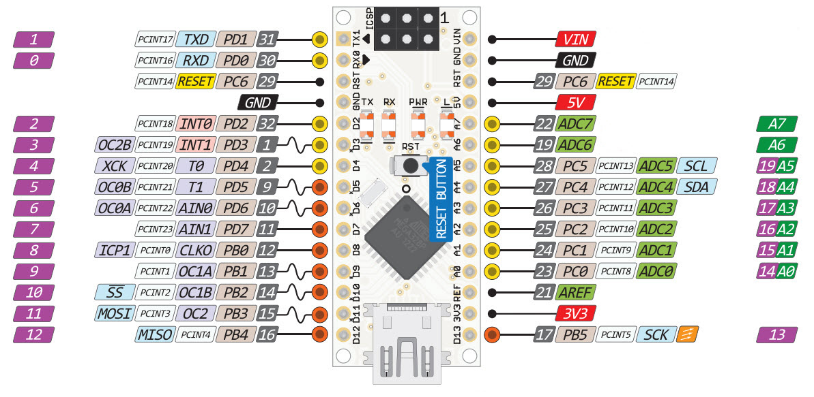
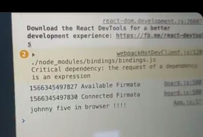

# To be considered

## 1

in

```
sameTime({pin:2,start:1,lapse:4},{pin:4,start:2,lapse:4},{pin:7,start:3,lapse:4})
```

specifically in

```
{pin:2,start:1,lapse:4}
```

`start` should be better called `period`

`lapse` should be understood as _duration_

## 2



Should this be a global variable :

`pines` global ---> 13(0-12) length array with `five.Pin ({pin:i,mode:1})`

http://johnny-five.io/api/pin/

modes:

| mode   | value | constant   |
| ------ | ----- | ---------- |
| INPUT  | 0     | Pin.INPUT  |
| OUTPUT | 1     | Pin.OUTPUT |
| ANALOG | 2     | Pin.ANALOG |
| PWM    | 3     | Pin.PWM    |
| SERVO  | 4     | Pin.SERVO  |

# doc

## `loopArduino`

```
loopArduino(3,10)
```

```
loopArduino(3,10)
cambiarIntervalo(500)
detenerLoop()
```

# online upload of firmata

https://firmata.netlify.app/

# online upload for johnny-five

Show's loading success and blinks led at pin 13;
**without any plugins or extensions!**:

You can use any arduino **that has firmata on it**.

https://j5ws.netlify.app/

## React app

Only a couple weird things done on top of `App.js`. The standard create-react-app built in webpack worked fine.

### The repo itself

Is at https://github.com/monteslu/j5-browser-serial-demo

## Used libraries

Thanks to

- _@reillyeon_
  for browser serialport and
- _@noopkat_
  for the quick node-serialport shim.
- this was also much easier thanks the the work
  _@rwaldron_ has done in order to decouple the firmata protocol from node-serialport and to make the transport pluggable



## Haven't been able to make it work.

When installing the key transport library, the required compilation using `node-gyp` won't succeed. The transport library is a [branch (called **chrome-serial**)](https://github.com/monteslu/avrgirl-arduino/tree/chrome-serial) (`github:monteslu/avrgirl-arduino#chrome-serial`) in monteslu's fork of [avrgirl-arduino](https://github.com/noopkat/avrgirl-arduino) from _@noopkat_ aka _avrgirl_ aka _Suzanne Hinton_.

**Consider:** Use Canary (chrome 77) and enable Experimental Web Platform features in chrome://flags

There's people how've been able to use as shown in this [twitter thread](https://twitter.com/monteslu/status/1163966447623688193)

## Merge

This is the merging from monteslu into noopkat https://github.com/noopkat/avrgirl-arduino/pull/177/files, so I should be able to use directly avrgirl-arduino, shouldn't I.
